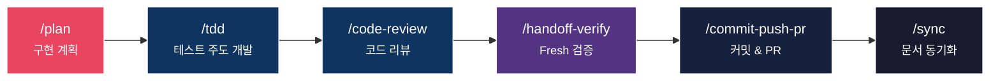
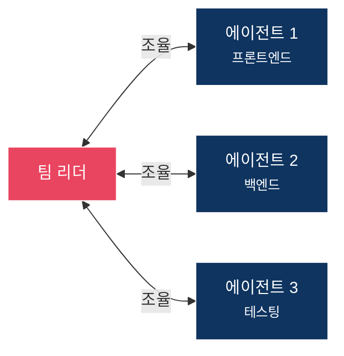
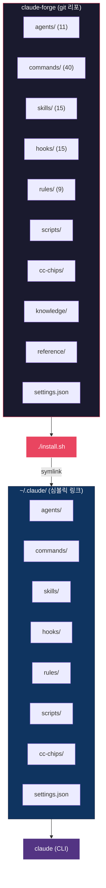

<picture>
  <source media="(prefers-color-scheme: dark)" srcset="docs/banner.jpg">
  <source media="(prefers-color-scheme: light)" srcset="docs/banner-light.jpg">
  
</picture>

<p align="center">
  <strong>Claude Code를 위한 프로덕션 수준 설정 프레임워크</strong>
</p>

<p align="center">
  <a href="LICENSE"></a>
  <a href="https://claude.com/claude-code"></a>
  <a href="https://github.com/sangrokjung/claude-forge/stargazers"></a>
  <a href="https://github.com/sangrokjung/claude-forge/network/members"></a>
  <a href="https://github.com/sangrokjung/claude-forge/graphs/contributors"></a>
  <a href="https://github.com/sangrokjung/claude-forge/commits/main"></a>
</p>

<p align="center">
  <a href="#-v30-업데이트">v3.0 업데이트</a> &bull;
  <a href="#-빠른-시작">빠른 시작</a> &bull;
  <a href="#-개발-워크플로우">개발 워크플로우</a> &bull;
  <a href="#-구성-요소">구성 요소</a> &bull;
  <a href="#-설치-가이드">설치 가이드</a> &bull;
  <a href="#-아키텍처">아키텍처</a> &bull;
  <a href="README.md">English</a>
</p>

> 🎉 **v3.0.2 공개 (2026년 5월)** — v3.0.1 위에 추가된 docs-only patch: LLM-readable 설치 경로(루트 `INSTALL.md` + 상단 한-줄 설치) + 다채널 배포. v3.0.1 baseline은 Anthropic 2026 표준 정렬(Hooks 21+ 이벤트 · Subagent frontmatter v2 · Skills/Commands 하이브리드 정책) + MCP 최소 구성(4개: playwright · context7 · jina-reader · chrome-devtools@0.23.0). 상세: [MIGRATION.md](MIGRATION.md) / [MIGRATION.ko.md](MIGRATION.ko.md), [Release v3.0.2](https://github.com/sangrokjung/claude-forge/releases/tag/v3.0.2), [Release v3.0.1](https://github.com/sangrokjung/claude-forge/releases/tag/v3.0.1).

> 🚀 **한 줄 설치** (전체 설치, 권장):
> ```bash
> curl -fsSL https://raw.githubusercontent.com/sangrokjung/claude-forge/main/install.sh | bash
> ```
> 또는 Claude Code 세션 안에서: `/plugin marketplace add sangrokjung/claude-forge` → `/plugin install claude-forge` (lightweight, plugin-only).
> 상세: [`INSTALL.md`](INSTALL.md).

---

## Claude Forge란?

Claude Forge는 **Claude Code**를 기본 CLI에서 **완전한 개발 환경**으로 변환합니다. 설치 한 번으로 **11개 전문 에이전트**(Opus 6 + Sonnet 5, frontmatter v2), **33개 슬래시 커맨드**, **24개 스킬 워크플로우**(16 native + 8 commands에서 이전), **15개 자동화 훅 + 9개 opt-in 예제**(21 lifecycle 이벤트 커버), **9개 규칙 파일**, **4개 MCP 서버**(minimal · chrome-devtools 포함, 7개 이상 optional)가 모두 연결되어 즉시 사용 가능합니다.

> oh-my-zsh가 터미널을 강화하듯, Claude Forge는 AI 코딩 어시스턴트를 **파워 유저 도구**로 업그레이드합니다.

---

## ⚡ 빠른 시작

### 옵션 1 — Claude Code 플러그인 (부분 지원, v3.0.1+)

Claude Code 안에서 마켓플레이스를 등록하고 플러그인을 설치합니다:

```
/plugin marketplace add sangrokjung/claude-forge
/plugin install claude-forge
```

업데이트는 `/plugin update claude-forge`(또는 `/plugin` UI).

> ⚠️ **부분 지원 — 선택 전 꼭 읽어주세요.** 현재 Claude Code 플러그인 로더는
> `commands/`와 (대부분의) `skills/`만 자동 로드합니다. `agents/`, `hooks/`, `rules/`,
> `statusLine`, `settings.json`의 env 블록, `mcp-servers.json` 항목은 **자동 연결되지
> 않습니다.** claude-forge의 한계가 아니라 Claude Code 로더의 현재 정책입니다. 전체
> 리소스를 원하시면 **옵션 2**를 선택하세요. 상세 비교:
> [`docs/PLUGIN-VS-INSTALL-SH.md`](docs/PLUGIN-VS-INSTALL-SH.md).

### 옵션 2 — `install.sh` 심볼릭 링크 설치 (전체 지원, 권장)

```bash
# 1. 클론 (서브모듈은 선택 — CC CHIPS 상태바만 해당)
git clone --recurse-submodules https://github.com/sangrokjung/claude-forge.git
cd claude-forge

# 2. 설치 (~/.claude에 심볼릭 링크 생성)
./install.sh

# 3. Claude Code 실행
claude
```

`install.sh`는 모든 리소스를 `~/.claude/` 아래로 심볼릭 링크합니다. 따라서 `git pull`
한 번이면 즉시 반영되며, **에이전트 + 훅 + 규칙 + MCP 4종 + 상태바**까지 한 번에
배포되는 유일한 경로입니다. `--recurse-submodules` 없이 클론해도 동작합니다 —
CC CHIPS 서브모듈은 옵션이며, 비어 있으면 설치기가 한 줄 안내만 출력하고 건너뜁니다.

### 어떤 옵션을 선택할까?

| 리소스 | 옵션 1 (`/plugin install`) | 옵션 2 (`./install.sh`) |
|--------|:--------------------------:|:------------------------:|
| Commands (33)          | ✅ | ✅ |
| Skills (24)            | ⚠️ 일부¹                 | ✅ |
| Agents (11)            | ❌ | ✅ |
| Hooks (15 + 예제 9)    | ❌² | ✅ |
| Rules (9)              | ❌ | ✅ |
| MCP 서버 (4개)         | ❌³ | ✅ |
| statusLine (CC CHIPS)  | ❌ | ✅ (선택 서브모듈) |
| `settings.json` env    | ❌ | ✅ |

¹ 플러그인으로 로드된 skill은 동작하지만, QJC skill 중 `~/.claude/rules/`나
`~/.claude/agents/`를 참조하는 것들은 심볼릭 링크 레이아웃을 전제로 합니다.
² `hooks/hooks.json` 파일에 명시된 것처럼, Claude Code는 별도의 `hooks.json`을 로드
하지 않고 `settings.json`에서만 훅을 읽으며, 옵션 1은 사용자 `settings.json`을 병합하지
않습니다.
³ `plugin.json`의 `mcpServers` 필드를 현재 로더가 인식하지 않습니다. MCP 서버는
`.mcp.json` / `mcp-servers.json`에서 로드되며, 이 경로는 옵션 2만 연결합니다.

**권장**: Commands + 일부 Skills만 필요한 경우가 아니라면 옵션 2를 선택하세요.

### 🎉 v3.0 업데이트

| 변경 | 설명 |
|:-----|:-----|
| **Hooks 21 이벤트** | 라이프사이클 훅이 5개에서 21개로 확장되었습니다. Opt-in 샘플은 [`hooks/examples/`](hooks/examples/)에, 전체 카탈로그는 [`hooks/README.md`](hooks/README.md)에 있습니다. |
| **Subagent Frontmatter v2** | 10개 선택 필드 추가: `isolation`, `background`, `memory`, `maxTurns`, `skills`, `mcpServers`, `effort`, `hooks`, `permissionMode`, `disallowedTools`. 스키마: [`reference/agent-schema.json`](reference/agent-schema.json). 상세: [`docs/AGENT-FRONTMATTER-V2.md`](docs/AGENT-FRONTMATTER-V2.md). |
| **Skills/Commands 하이브리드 정책** | 경계를 [`docs/SKILLS-VS-COMMANDS.md`](docs/SKILLS-VS-COMMANDS.md)에 명문화. 디렉토리 형태의 커맨드 8개가 `skills/`로 이전되며, 기존 경로는 심볼릭 링크로 호환성 유지. |
| **MCP 최소 구성 (v3.0.1, 4개)** | 기본 서버: `playwright` · `context7` · `jina-reader` · `chrome-devtools-mcp@0.23.0` (Google ChromeDevTools 공식, Apache-2.0 — Lighthouse/Core Web Vitals 감사를 위해 v3.0.1에서 승격). 레거시 전체 세트는 [`mcp-servers.optional.json`](mcp-servers.optional.json)에 보존. 전환 레시피: [`docs/MCP-MIGRATION.md`](docs/MCP-MIGRATION.md). 결정 근거: [`docs/adr/ADR-001-mcp-default-set.md`](docs/adr/ADR-001-mcp-default-set.md). |
| **CLAUDE.md 템플릿 + @import** | [`setup/CLAUDE.md.template`](setup/CLAUDE.md.template)과 [`docs/CLAUDE-MD-GUIDE.md`](docs/CLAUDE-MD-GUIDE.md) 신규. 200줄 원칙과 `@import` 패턴으로 모듈형 프로젝트 지침을 구성합니다. |
| **settings.json 2026 필드** | 신규 필드: `tui` (깜박임 없는 렌더링), `disableSkillShellExecution` (샌드박싱), `enabledMcpjsonServers` (명시적 허용 목록). |
| **원커맨드 업그레이드** | `./install.sh --upgrade` — 기존 v2.1 설치를 백업 및 diff 미리보기와 함께 안전하게 마이그레이션합니다. |

### 🔧 v3.0.1 업데이트 (패치)

| 변경 | 설명 |
|:-----|:-----|
| **플러그인 매니페스트 배포 (부분)** | `/plugin marketplace add sangrokjung/claude-forge` + `/plugin install claude-forge`로 Commands와 Skills 사용 가능. [`.claude-plugin/plugin.json`](.claude-plugin/plugin.json) + [`.claude-plugin/marketplace.json`](.claude-plugin/marketplace.json) 모두 `3.0.2`로 통일. CI `marketplace-schema` 잡이 버전 drift를 자동 차단합니다. Agents / Hooks / Rules / MCP / statusLine은 여전히 `./install.sh` 필요 — 상세 비교: [`docs/PLUGIN-VS-INSTALL-SH.md`](docs/PLUGIN-VS-INSTALL-SH.md). |
| **Chrome DevTools 승격** | 기본 4-서버 MCP 세트에 Lighthouse / Core Web Vitals / 메모리 스냅샷이 합류. `chrome-devtools-mcp@0.23.0`로 버전 고정(supply-chain 강화). |
| **`hooks/_lib/timing.sh`** | SessionEnd 훅의 실행 시점을 `~/.claude/logs/hook-timing.jsonl`(권한 600)에 기록하는 래퍼 신규. `async: true` 훅의 실제 병렬성을 사후 검증할 수 있음. 오버헤드 약 35 ms. |
| **CI 트리거 확장** | [`.github/workflows/validate.yml`](.github/workflows/validate.yml)가 전 PR과 `main`/`feat/**`/`fix/**`/`chore/**`/`docs/**`/`ci/**` 푸시에서 실행됩니다(이전에는 `main`만). 총 6개 job. |
| **Tier 0 스펙 정합성 정정** | 훅 타입을 공식 규격에 맞춤(`command`/`http`/`prompt`/`agent` — 이전 `llm-prompt`/`mcp-tool`). `timeout` 단위 **초**로 정정(이전 ms). Auto Memory 경로 `~/.claude/projects/<project>/memory/`(이전 `<hash>`). |
| **신규 거버넌스 문서** | [`docs/adr/ADR-001-mcp-default-set.md`](docs/adr/ADR-001-mcp-default-set.md)(MCP 기본 세트 결정 기록, MADR) · [`docs/SETTINGS-COMPATIBILITY.md`](docs/SETTINGS-COMPATIBILITY.md)(UNVERIFIED 필드 추적) · [`docs/MARKETPLACE-SUBMISSION.md`](docs/MARKETPLACE-SUBMISSION.md)(공식 디렉토리 제출 패킷). |
| **4-방향 독립 회의적 리뷰** | super-research(Tier 0 docs) · security-reviewer · architect · codex-reviewer가 병렬로 패치를 검증. 병합 전 11개 블로킹 이슈 해소. |

### 🚨 Breaking Changes

- **MCP 기본 축소** — `memory`, `exa`, `github`, `fetch`가 `mcp-servers.json`에서 제거되었습니다. 필요 시 [`mcp-servers.optional.json`](mcp-servers.optional.json)에서 복원하세요. 대체 수단: Auto Memory, `gh` CLI, `WebSearch`, `jina-reader` 폴백으로 대부분의 기존 용도를 커버합니다.
- **커맨드 8개가 `skills/`로 이동** — 심볼릭 링크 호환은 **2027-04-01**까지 유지됩니다. 대상: `debugging-strategies`, `dependency-upgrade`, `evaluating-code-models`, `evaluating-llms-harness`, `extract-errors`, `security-compliance`, `stride-analysis-patterns`, `summarize`.
- **settings.json allowlist 변경** — `mcp__memory`, `mcp__exa`, `mcp__github`, `mcp__fetch` 제거. `mcp__playwright` 추가.

### 왜 v3.0인가

2026년 Anthropic Claude Code 표준이 크게 진화했습니다(Skills/Commands 통합, Hooks 21 이벤트, Subagent frontmatter 확장). v3.0은 이 표준에 완전 정렬하면서, 동시에 **기본 MCP 의존성을 6개 → 4개로 축소**(v3.0은 3개 기본, v3.0.1에서 `chrome-devtools-mcp@0.23.0` 기본 세트로 승격) 신규 사용자 진입 장벽을 낮추고, dotclaude 운영 경험(보안 allowlist, breakage-safe migration)을 반영했습니다. 기존 v2.1 사용자는 `./install.sh --upgrade` 한 줄로 이동 가능합니다.

### 처음이신가요?

개발이 처음이거나 Claude Code가 낯설다면, 여기서 시작하세요:

| 단계 | 할 일 |
|:----:|:------|
| 1 | 설치 후 `/guide` 실행 -- 3분 인터랙티브 투어 |
| 2 | [첫 사용자 가이드](docs/FIRST-STEPS.md) 읽기 -- 용어 사전 + TOP 6 커맨드 |
| 3 | [상황별 레시피](docs/WORKFLOW-RECIPES.md) 보기 -- 복사해서 쓰는 5가지 시나리오 |

또는 `/auto 로그인 페이지 만들기`를 입력하면, 계획부터 PR까지 알아서 진행합니다.

---

## 🔄 개발 워크플로우

<p align="center">
  
</p>

### 새 기능 개발

계획 수립부터 PR 생성까지 한 번에 진행합니다.

```
/plan → /tdd → /code-review → /handoff-verify → /commit-push-pr → /sync
```



| 단계 | 커맨드 | 설명 |
|:----:|:-------|:-----|
| 1 | `/plan` | planner 에이전트가 구현 계획, 의존성, 리스크를 분석 |
| 2 | `/tdd` | tdd-guide 에이전트가 RED→GREEN→IMPROVE 사이클 진행 |
| 3 | `/code-review` | code-reviewer 에이전트가 CRITICAL/HIGH/MEDIUM 이슈 분류 |
| 4 | `/handoff-verify` | verify-agent가 새 컨텍스트에서 빌드·테스트·린트 검증 |
| 5 | `/commit-push-pr` | 커밋 메시지 작성, 푸시, PR 생성까지 자동화 |
| 6 | `/sync` | 프로젝트 문서 동기화 (prompt_plan.md, spec.md, CLAUDE.md, rules) |

### 버그 수정

```
/explore → /tdd → /verify-loop → /quick-commit → /sync
```

| 단계 | 커맨드 | 설명 |
|:----:|:-------|:-----|
| 1 | `/explore` | 코드베이스를 탐색하여 원인 파악 |
| 2 | `/tdd` | 실패 테스트 작성 → 최소 수정 → 통과 확인 |
| 3 | `/verify-loop` | 빌드·테스트를 반복 검증하며 사이드 이펙트 확인 |
| 4 | `/quick-commit` | 빠른 커밋 & 푸시 |
| 5 | `/sync` | 커밋 후 프로젝트 문서 동기화 |

### 보안 감사

```
/security-review → /stride-analysis-patterns → /security-compliance
```

| 단계 | 커맨드 | 설명 |
|:----:|:-------|:-----|
| 1 | `/security-review` | security-reviewer 에이전트가 OWASP Top 10 기반 분석 |
| 2 | `/stride-analysis-patterns` | STRIDE 위협 모델링 수행 |
| 3 | `/security-compliance` | SOC2, GDPR 등 컴플라이언스 검증 |

### 팀 협업

<p align="center">
  
</p>

```
/orchestrate
```

`/orchestrate` 커맨드로 Agent Teams를 구성하여 병렬 작업을 수행합니다.



- **Hub-and-spoke** 통신 (리더가 조율)
- **파일 소유권** 분리 (머지 충돌 없음)
- **페이즈 기반** 팀 교체
- 결정 사항은 `decisions.md`로 외부화

---

## 📦 구성 요소

<p align="center">
  
</p>

| 카테고리 | 수량 | 주요 항목 |
|:--------:|:----:|:----------|
| **에이전트** | 11 | `planner` `architect` `code-reviewer` `security-reviewer` `tdd-guide` `database-reviewer` (Opus) / `build-error-resolver` `e2e-runner` `refactor-cleaner` `doc-updater` `verify-agent` (Sonnet) — frontmatter v2 지원 |
| **커맨드** | 40 | `/commit-push-pr` `/handoff-verify` `/explore` `/tdd` `/plan` `/orchestrate` `/security-review` ... (하이브리드 정책) |
| **스킬** | 15+ | `build-system` `security-pipeline` `eval-harness` `team-orchestrator` `session-wrap` ... (+커맨드에서 이전 8개) |
| **훅** | 18 + 9 예제 | 보안 방어 6개 + 유틸리티 12개(built-in) + 21 lifecycle 이벤트 샘플 9개(opt-in) |
| **규칙** | 9 | `coding-style` `security` `git-workflow` `golden-principles` `agents-v2` `verification` ... |
| **MCP 서버** | 4 (minimal) | `playwright` `context7` `jina-reader` `chrome-devtools@0.23.0` — 7개 이상은 [`mcp-servers.optional.json`](mcp-servers.optional.json) |

---

## 📥 설치 가이드

### 사전 요구사항

| 도구 | 용도 |
|:-----|:-----|
| **Node.js** | MCP 서버 실행 (npx) |
| **jq** | JSON 파싱 (설치 스크립트) |
| **Git** | 클론, 서브모듈 |
| **Claude Code CLI** | `claude` 명령어 |

### macOS / Linux

```bash
# 클론 (서브모듈 포함)
git clone --recurse-submodules https://github.com/sangrokjung/claude-forge.git
cd claude-forge

# 신규 설치 (심볼릭 링크 생성)
./install.sh

# 또는 v2.1 → v3.0 안전 마이그레이션 (백업 + diff 미리보기)
./install.sh --upgrade
```

설치 스크립트가 수행하는 작업:

1. 의존성 확인 (node, jq, git)
2. Git 서브모듈 초기화 (CC CHIPS)
3. 기존 `~/.claude/` 백업 (선택)
4. `~/.claude/`에 심볼릭 링크 생성
5. CC CHIPS 커스텀 오버레이 적용
6. MCP 서버 설치 (선택)
7. 외부 스킬 설치 (선택)
8. 셸 별칭 설정 (`cc`, `ccr`)

심볼릭 링크 기반이므로 `git pull` 한 번이면 즉시 반영됩니다. v3.0으로 당겨 온 뒤에는 `--upgrade`로 MCP/settings 마이그레이션까지 제자리에서 적용할 수 있습니다.

### Windows (WSL)

WSL에서 Windows 파일시스템(`/mnt/c/...`)에 클론한 경우 심볼릭 링크 대신 **복사**로 설치됩니다.

```bash
# WSL 네이티브 경로에 클론하면 심볼릭 링크 사용 가능
cd ~ && git clone --recurse-submodules https://github.com/sangrokjung/claude-forge.git
cd claude-forge && ./install.sh
```

### Windows (PowerShell)

```powershell
.\install.ps1
```

### MCP 서버 설정

v3.0.1은 **기본 4개**를 탑재합니다. 나머지는 [`mcp-servers.optional.json`](mcp-servers.optional.json)에서 opt-in으로 복원합니다. 레시피: [`docs/MCP-MIGRATION.md`](docs/MCP-MIGRATION.md). 근거: [`docs/adr/ADR-001-mcp-default-set.md`](docs/adr/ADR-001-mcp-default-set.md).

| 서버 | 기본 여부 | API 키 필요 | 설명 |
|:-----|:--------:|:----------:|:-----|
| **playwright** | ✅ | - | 브라우저 자동화 / E2E |
| **context7** | ✅ | - | 실시간 라이브러리 문서 조회 |
| **jina-reader** | ✅ | - | URL → 마크다운 변환 |
| **chrome-devtools** | ✅ | - | Lighthouse / Core Web Vitals / 메모리 스냅샷 (Google ChromeDevTools 공식, `@0.23.0` 핀) |
| **memory** | opt-in | - | 영속적 지식 그래프 (Auto Memory로 대체 가능) |
| **fetch** | opt-in | - | 웹 콘텐츠 가져오기 (`uvx` 필요) |
| **github** | opt-in | `GITHUB_PERSONAL_ACCESS_TOKEN` | 리포/PR/이슈 관리 (`gh` CLI로 대체 가능) |
| **exa** | opt-in | 인증 필요 | AI 기반 웹 검색 (`WebSearch`로 대체 가능) |

### 커스터마이징

추적되는 파일을 수정하지 않고 설정을 오버라이드할 수 있습니다:

```bash
# 로컬 오버라이드 파일 생성 (git-ignored)
cp setup/settings.local.template.json ~/.claude/settings.local.json

# 시크릿/환경설정 편집
vim ~/.claude/settings.local.json
```

`settings.local.json`은 Claude Code가 `settings.json` 위에 병합합니다.

---

## 🏗 아키텍처

> **Skills vs Commands** — `skills/`는 자동 호출되는 지식과 재사용 워크플로우를 담습니다(Claude가 description 트리거로 발견). `commands/`는 사용자가 `/name`을 직접 입력해 타이밍을 결정하는 부작용 실행을 담습니다. 정책 상세는 [docs/SKILLS-VS-COMMANDS.md](docs/SKILLS-VS-COMMANDS.md) 참조.

<p align="center">
  
</p>



설치 스크립트가 리포에서 `~/.claude/`로 **심볼릭 링크**를 생성하므로, `git pull` 한 번으로 즉시 업데이트됩니다.

<details>
<summary><strong>전체 디렉토리 구조</strong></summary>

```
claude-forge/
  ├── .claude-plugin/            플러그인 매니페스트
  ├── .github/workflows/         CI 검증
  ├── agents/                    에이전트 정의 (11 .md, frontmatter v2)
  ├── cc-chips/                  상태바 서브모듈
  ├── cc-chips-custom/           커스텀 상태바 오버레이
  ├── commands/                  슬래시 커맨드 (32 .md, 8개는 skills/로 이동)
  ├── docs/                      스크린샷, 다이어그램, 정책 문서 (v3.0 가이드)
  ├── hooks/                     이벤트 기반 스크립트 (18)
  │   └── examples/              21 lifecycle 이벤트 샘플 opt-in (9)
  ├── knowledge/                 지식 베이스
  ├── reference/                 참조 문서 (+ agent-schema.json)
  ├── rules/                     자동 로드 규칙 파일 (9)
  ├── scripts/                   유틸리티 스크립트
  ├── setup/                     설치 가이드 + CLAUDE.md 템플릿
  ├── skills/                    다단계 스킬 워크플로우 (15+, 하이브리드 정책)
  ├── install.sh                 macOS/Linux 설치 (--upgrade 지원)
  ├── install.ps1                Windows 설치 (--upgrade 지원)
  ├── mcp-servers.json           MCP 기본 설정 (4 minimal)
  ├── mcp-servers.optional.json  MCP 선택 서버 (memory/exa/github/fetch/time/...)
  ├── .claude-plugin/plugin.json 플러그인 매니페스트 (3.0.2)
  ├── .claude-plugin/marketplace.json  마켓플레이스 엔트리 (3.0.2)
  ├── settings.json              Claude Code 설정 (2026 필드)
  ├── MIGRATION.md               v2.1 → v3.0 마이그레이션 가이드 (EN)
  ├── MIGRATION.ko.md            v2.1 → v3.0 마이그레이션 가이드 (KO)
  ├── CONTRIBUTING.md            기여 가이드
  ├── SECURITY.md                보안 정책
  └── LICENSE                    MIT 라이선스
```

</details>

---

## 🛡 자동화 훅

### 보안 훅

<p align="center">
  
</p>

모든 작업이 계층형 보안 훅을 통과합니다:

| 단계 | 훅 | 방어 대상 |
|:----:|:---|:----------|
| 1 | `output-secret-filter.sh` | 출력에 노출된 API 키, 토큰 |
| 2 | `remote-command-guard.sh` | 안전하지 않은 원격 명령 |
| 3 | `db-guard.sh` | 파괴적 SQL (DROP, TRUNCATE) |
| 4 | `security-auto-trigger.sh` | 코드 변경 시 취약점 자동 탐지 |
| 5 | `rate-limiter.sh` | API 호출 속도 제한 |
| 6 | `expensive-mcp-warning.sh` | 고비용 MCP 호출 경고 |

### 유틸리티 훅

| 훅 | 기능 |
|:---|:-----|
| `code-quality-reminder.sh` | 코드 품질 체크리스트 알림 |
| `context-sync-suggest.sh` | 컨텍스트 동기화 제안 |
| `forge-update-check.sh` | 세션 시작 시 프레임워크 업데이트 확인 |
| `mcp-usage-tracker.sh` | MCP 사용량 추적 |
| `session-wrap-suggest.sh` | 세션 종료 시 정리 제안 |
| `task-completed.sh` | 작업 완료 알림 |
| `work-tracker-prompt.sh` | 작업 추적 프롬프트 |
| `work-tracker-stop.sh` | 작업 추적 종료 |
| `work-tracker-tool.sh` | 작업 추적 도구 |

### Opt-in 예제 (v3.0)

최신 라이프사이클 이벤트(SessionEnd, PreCompact, SubagentStart/Stop, MessageStart/End, UserPromptReceived 등)를 다루는 9개 `.example` 샘플이 [`hooks/examples/`](hooks/examples/)에 함께 배포됩니다. 전체 21 이벤트 카탈로그와 레시피는 [`hooks/README.md`](hooks/README.md)에서 확인할 수 있습니다. `*.example` → `*.sh`로 이름을 바꾸고 `settings.json`에 등록하면 활성화됩니다.

---

## 🤖 에이전트

각 에이전트는 UI에서 역할별 **색상**으로 구분됩니다:

### Opus (고성능 추론)

| 에이전트 | 색상 | 역할 |
|:---------|:----:|:-----|
| `planner` | blue | 복잡한 기능의 구현 계획 수립, 의존성/리스크 분석 |
| `architect` | blue | 시스템 설계, 확장성, 기술 의사결정 |
| `code-reviewer` | blue | CRITICAL/HIGH/MEDIUM 이슈 분류 코드 리뷰 |
| `security-reviewer` | red | OWASP Top 10 기반 보안 분석 |
| `tdd-guide` | cyan | RED → GREEN → IMPROVE 테스트 주도 개발 |
| `database-reviewer` | blue | PostgreSQL/Supabase 스키마, 쿼리 최적화 |

### Sonnet (빠른 실행)

| 에이전트 | 색상 | 역할 |
|:---------|:----:|:-----|
| `build-error-resolver` | cyan | 빌드/TypeScript 오류 즉시 수정 |
| `e2e-runner` | cyan | E2E 테스트 생성, 실행, 관리 |
| `refactor-cleaner` | yellow | 데드 코드 제거, 중복 코드 정리 |
| `doc-updater` | yellow | 문서/코드맵 자동 업데이트 |
| `verify-agent` | cyan | 새 컨텍스트에서 빌드·테스트·린트 검증 |

### 색상 체계

| 색상 | 의미 |
|:-----|:-----|
| **blue** | 분석/리뷰 |
| **cyan** | 테스트/검증 |
| **yellow** | 유지보수/데이터 |
| **red** | 보안/경고 |
| **magenta** | 크리에이티브/리서치 |
| **green** | 비즈니스/성공 |

---

<details>
<summary><strong>📋 전체 커맨드 목록 (33개)</strong></summary>

| 커맨드 | 설명 |
|:-------|:-----|
| `/build-fix` | 빌드 오류 자동 수정 |
| `/checkpoint` | 현재 상태 체크포인트 저장 |
| `/code-review` | 방금 작성한 코드를 보안+품질 검사 |
| `/commit-push-pr` | 커밋, 푸시, PR 생성 자동화 |
| `/debugging-strategies` | 디버깅 전략 가이드 |
| `/dependency-upgrade` | 의존성 업그레이드 관리 |
| `/e2e` | E2E 테스트 실행 |
| `/eval` | 코드 모델 평가 |
| `/evaluating-code-models` | 코드 모델 벤치마크 |
| `/evaluating-llms-harness` | LLM 하네스 평가 |
| `/explore` | 코드베이스를 탐색하여 구조를 파악 |
| `/extract-errors` | 오류 추출 및 분석 |
| `/forge-update` | Claude Forge 프레임워크를 최신 버전으로 업데이트 |
| `/handoff-verify` | 빌드/테스트/린트 한 번에 자동 검증 |
| `/init-project` | 프로젝트 초기 설정 |
| `/learn` | 학습 및 지식 축적 |
| `/next-task` | 다음 작업 할당 |
| `/orchestrate` | Agent Teams 멀티 에이전트 구성 |
| `/plan` | AI가 구현 계획을 세워줍니다 |
| `/pull` | 원격 변경사항 가져오기 |
| `/quick-commit` | 빠른 커밋 & 푸시 |
| `/refactor-clean` | 리팩토링 및 코드 정리 |
| `/security-compliance` | 보안 컴플라이언스 검증 |
| `/security-review` | 보안 리뷰 실행 |
| `/stride-analysis-patterns` | STRIDE 위협 모델링 |
| `/suggest-automation` | 자동화 기회 제안 |
| `/summarize` | 코드/문서 요약 |
| `/sync-docs` | 문서 동기화 |
| `/sync` | 최신 변경사항 풀 + 프로젝트 문서 동기화 (prompt_plan.md, spec.md, CLAUDE.md, rules). 워크플로우 완료 후 또는 세션 시작 시 사용. |
| `/tdd` | 테스트 먼저 만들고 코드 작성 |
| `/test-coverage` | 테스트 커버리지 분석 |
| `/update-codemaps` | 코드맵 업데이트 |
| `/update-docs` | 문서 업데이트 |
| `/verify-loop` | 빌드·테스트 반복 검증 |
| `/web-checklist` | 웹 체크리스트 검사 |
| `/worktree-cleanup` | 워크트리 정리 |
| `/worktree-start` | 워크트리 시작 |
| `/auto` | 계획부터 PR까지 원버튼 자동 실행 |
| `/guide` | 처음 사용자를 위한 3분 인터랙티브 가이드 |
| `/show-setup` | 설치 상태와 프로젝트 정보 보기 |

</details>

<details>
<summary><strong>🎯 전체 스킬 목록 (15개)</strong></summary>

| 스킬 | 설명 |
|:-----|:-----|
| `build-system` | 빌드 시스템 구성 및 관리 |
| `cache-components` | 캐시 컴포넌트 패턴 |
| `cc-dev-agent` | Claude Code 개발 에이전트 워크플로우 |
| `continuous-learning-v2` | 지속적 학습 및 진화 시스템 |
| `eval-harness` | LLM 평가 하네스 |
| `frontend-code-review` | 프론트엔드 코드 리뷰 |
| `manage-skills` | 스킬 관리 도구 |
| `prompts-chat` | 프롬프트 채팅 |
| `security-pipeline` | 보안 파이프라인 |
| `session-wrap` | 세션 정리 및 래핑 |
| `skill-factory` | 스킬 생성 팩토리 |
| `strategic-compact` | 전략적 컴팩트 |
| `team-orchestrator` | 팀 오케스트레이터 |
| `verification-engine` | 검증 엔진 |
| `verify-implementation` | 구현 검증 |

</details>

---

## 🔌 MCP 서버

`mcp-servers.json`에는 **기본 4개**, `mcp-servers.optional.json`에는 **선택 서버**가 사전 구성되어 있습니다 -- `./install.sh` 또는 `claude mcp add`로 설치합니다. 전환 레시피: [`docs/MCP-MIGRATION.md`](docs/MCP-MIGRATION.md).

| 서버 | 기본 여부 | 용도 |
|:-----|:--------:|:-----|
| **playwright** | ✅ | 브라우저 자동화 / E2E |
| **context7** | ✅ | 실시간 라이브러리 문서 조회 |
| **jina-reader** | ✅ | URL → 마크다운 변환 |
| **chrome-devtools** | ✅ | Lighthouse / Core Web Vitals / 메모리 스냅샷 (`@0.23.0`) |
| **memory** | opt-in | 영속적 지식 그래프 |
| **exa** | opt-in | AI 기반 웹 검색 |
| **github** | opt-in | 리포/PR/이슈 관리 |
| **fetch** | opt-in | 웹 콘텐츠 가져오기 |

---

## 🎨 커스터마이징

<details>
<summary><strong>에이전트 추가하기</strong></summary>

`agents/` 디렉토리에 YAML frontmatter가 포함된 마크다운 파일을 생성하세요:

```markdown
---
name: my-agent
description: Use this agent when [트리거 조건]. Input: [입력]. Output: [출력].
tools: ["Read", "Grep", "Glob"]
model: sonnet
memory: project
color: blue
---

You are an expert [역할]. Your mission is to [목표].

## Process
1. [단계 1]
2. [단계 2]

## Output Format
[출력 형식]
```

지원 frontmatter 필드: `name` (필수), `description` (필수), `model`, `color`, `tools`, `memory`, `maxTurns`, `isolation`.

상세 필드 설명과 알려진 제한사항은 [reference/agents-config-ref.md](reference/agents-config-ref.md) 참조.

</details>

<details>
<summary><strong>슬래시 커맨드 추가하기</strong></summary>

`commands/` 디렉토리에 마크다운 파일을 생성하세요:

```markdown
# my-command.md

/my-command 실행 시 수행할 작업을 기술합니다.
```

</details>

<details>
<summary><strong>보안 훅 추가하기</strong></summary>

`hooks/` 디렉토리에 쉘 스크립트를 생성하고 `settings.json`에 등록하세요:

```bash
#!/bin/bash
# hooks/my-guard.sh
# 특정 도구 이벤트(PreToolUse, PostToolUse 등)에서 실행됩니다.
```

</details>

---

## 자주 묻는 질문

<details>
<summary><strong>/sync는 무엇을 하나요?</strong></summary>

`/sync`는 프로젝트 메모리와 문서를 동기화합니다. 원격 저장소에서 최신 변경사항을 풀한 뒤, 프로젝트 문서(`prompt_plan.md`, `spec.md`, `CLAUDE.md`, 규칙 파일)를 모두 동기화합니다. 워크플로우(기능 개발, 버그 수정, 리팩토링) 완료 후 또는 새 세션 시작 시 실행하면 Claude가 최신 컨텍스트를 유지합니다.

</details>

<details>
<summary><strong>Claude Forge는 세션 간 메모리를 어떻게 관리하나요?</strong></summary>

Claude Forge는 4계층 메모리 시스템을 사용합니다:

1. **프로젝트 문서** (`CLAUDE.md`, `prompt_plan.md`, `spec.md`) -- 저장소에 영속하는 프로젝트 수준 지침과 계획. `/sync`로 최신 상태를 유지합니다.
2. **규칙 파일** (`rules/`) -- 코딩 스타일, 보안, 워크플로우 규칙이 매 세션마다 자동 로드됩니다.
3. **MCP 메모리 서버** -- 세션 간 영속하는 지식 그래프로 엔티티와 관계를 저장합니다.
4. **에이전트 메모리** (`~/.claude/agent-memory/`) -- 핵심 에이전트가 작업 후 학습 내용을 기록하여 시간이 지남에 따라 추천 품질이 향상됩니다 (Self-Evolution).

세션 시작 시 `/sync`를 실행하면 1, 2 계층이 최신 상태가 됩니다. MCP 메모리 서버(3계층)와 에이전트 메모리(4계층)는 자동으로 영속합니다.

</details>

---

## 🤝 기여

에이전트, 커맨드, 스킬, 훅 추가 방법은 [CONTRIBUTING.md](CONTRIBUTING.md)를 참조하세요.

---

---

## Claude Forge를 사용하시나요? 배지를 달아주세요!

```markdown
[](https://github.com/sangrokjung/claude-forge)
```

이 배지를 프로젝트 README에 추가하여 Claude Forge 사용을 알려주세요.

---

## Contributors

<a href="https://github.com/sangrokjung/claude-forge/graphs/contributors">
  
</a>

---

## 📄 라이선스

[MIT](LICENSE) -- 자유롭게 사용, 포크, 확장하세요.

---

<p align="center">
  <sub>Made with ❤️ by <a href="https://github.com/sangrokjung">QJC (Quantum Jump Club)</a></sub>
</p>
