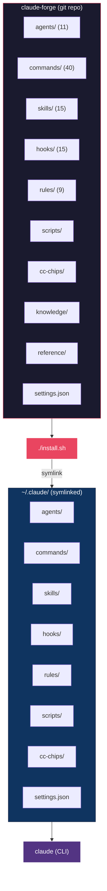

<picture>
  <source media="(prefers-color-scheme: dark)" srcset="docs/banner.jpg">
  <source media="(prefers-color-scheme: light)" srcset="docs/banner-light.jpg">
  
</picture>

<p align="center">
  <strong>Turn Claude Code into a full development environment</strong>
</p>

<p align="center">
  <a href="LICENSE"></a>
  <a href="https://claude.com/claude-code"></a>
  <a href="https://github.com/sangrokjung/claude-forge/stargazers"></a>
  <a href="https://github.com/sangrokjung/claude-forge/network/members"></a>
  <a href="https://github.com/sangrokjung/claude-forge/graphs/contributors"></a>
  <a href="https://github.com/sangrokjung/claude-forge/commits/main"></a>
</p>

<p align="center">
  <a href="#-whats-new-in-v30">What's New v3.0</a> &bull;
  <a href="#-quick-start">Quick Start</a> &bull;
  <a href="#-development-workflows">Workflows</a> &bull;
  <a href="#-whats-inside-claude-forge">What's Inside</a> &bull;
  <a href="#-claude-forge-installation-guide">Installation</a> &bull;
  <a href="#-claude-forge-architecture">Architecture</a> &bull;
  <a href="#-customization">Customization</a> &bull;
  <a href="README.ko.md">한국어</a>
</p>

> 🎉 **v3.0.2 released (May 2026)** — docs-only patch on top of v3.0.1: LLM-readable install paths (root `INSTALL.md` + above-the-fold one-liner) and multi-channel distribution. The v3.0.1 baseline brought Anthropic 2026 standard alignment (Hooks 21+ events · Subagent frontmatter v2 · Skills/Commands hybrid policy) plus a 4-server MCP minimum (playwright · context7 · jina-reader · chrome-devtools@0.23.0). See [MIGRATION.md](MIGRATION.md) / [MIGRATION.ko.md](MIGRATION.ko.md), [Release v3.0.2](https://github.com/sangrokjung/claude-forge/releases/tag/v3.0.2), [Release v3.0.1](https://github.com/sangrokjung/claude-forge/releases/tag/v3.0.1).

> 🚀 **Install in one line** (full install, recommended):
> ```bash
> curl -fsSL https://raw.githubusercontent.com/sangrokjung/claude-forge/main/install.sh | bash
> ```
> Or, inside an existing Claude Code session: `/plugin marketplace add sangrokjung/claude-forge` then `/plugin install claude-forge` (lightweight, plugin-only).
> Full details: [`INSTALL.md`](INSTALL.md).

---

## What is Claude Forge?

Claude Forge is an open-source development environment for Claude Code that provides 11 specialized agents, 33 slash commands, 24 skill workflows, 15 automation hooks (plus 9 opt-in examples covering 21 lifecycle events), and 9 rule files. Often described as "oh-my-zsh for Claude Code", it transforms Claude Code from a basic CLI into a full-featured development environment. One install gives you agents, commands, skills, hooks, and rules — all pre-wired and ready to go.

> Think of it as **oh-my-zsh for Claude Code**: the same way oh-my-zsh enhances your terminal, Claude Forge supercharges your AI coding assistant.

---

## ⚡ Quick Start

### Option 1 — Claude Code Plugin (partial coverage, v3.0.1+)

Inside Claude Code, register the marketplace once, then install the plugin:

```
/plugin marketplace add sangrokjung/claude-forge
/plugin install claude-forge
```

Update later via `/plugin update claude-forge` (or from the `/plugin` UI).

> ⚠️ **Partial coverage — please read before choosing.** The Claude Code plugin loader
> currently recognizes `commands/` and (most of) `skills/` but does **not** auto-wire
> `agents/`, `hooks/`, `rules/`, `statusLine`, `settings.json` env blocks, or the entries
> inside `mcp-servers.json`. That is a loader limitation, not a claude-forge one — see
> [`docs/PLUGIN-VS-INSTALL-SH.md`](docs/PLUGIN-VS-INSTALL-SH.md) for the full matrix. If
> you want every resource (agents, hooks, rules, MCP, statusLine) wired up, use
> **Option 2** below.

### Option 2 — Classic `install.sh` (full symlink install, recommended)

```bash
# 1. Clone (submodules optional — only needed for the CC CHIPS status bar)
git clone --recurse-submodules https://github.com/sangrokjung/claude-forge.git
cd claude-forge

# 2. Install (creates symlinks under ~/.claude)
./install.sh

# 3. Launch Claude Code
claude
```

`install.sh` symlinks every resource into `~/.claude/`, so `git pull` updates instantly,
and it is the only install path that delivers agents, hooks, rules, the 4 MCP servers,
and the status bar in one shot. Clone without `--recurse-submodules` still works: the CC
CHIPS submodule is optional and the installer skips it cleanly if the directory is empty
(a one-line hint is printed).

### Which option should I pick?

| Resource | Option 1 (`/plugin install`) | Option 2 (`./install.sh`) |
|----------|:----------------------------:|:-------------------------:|
| Commands (33)          | ✅ | ✅ |
| Skills (24)            | ⚠️ partial¹                | ✅ |
| Agents (11)            | ❌ | ✅ |
| Hooks (15 + 9 examples)| ❌² | ✅ |
| Rules (9)              | ❌ | ✅ |
| MCP servers (4)        | ❌³ | ✅ |
| statusLine (CC CHIPS)  | ❌ | ✅ (opt-in submodule) |
| `settings.json` env    | ❌ | ✅ |

¹ Plugin-loaded skills are supported, but QJC skill features that reach into
`~/.claude/rules/` or `~/.claude/agents/` assume the symlink layout.
² See `hooks/hooks.json`: Claude Code does not load a separate `hooks.json`; all hook
settings must live in `settings.json`, which Option 1 does not merge.
³ `plugin.json` does not currently surface `mcpServers` in a way the loader acts on. MCP
servers come from `.mcp.json` / `mcp-servers.json`, which only Option 2 wires up.

**Recommendation:** Use Option 2 unless you only need Commands + a subset of Skills.

> If you find Claude Forge useful, please consider giving it a [star](https://github.com/sangrokjung/claude-forge/stargazers) -- it helps others discover this project.

### 🎉 What's New in v3.0

| Change | Description |
|:-------|:------------|
| **Hooks 21 Events** | Lifecycle hooks expanded from 5 to 21 events. Opt-in samples live at [`hooks/examples/`](hooks/examples/) with the full catalog in [`hooks/README.md`](hooks/README.md). |
| **Subagent Frontmatter v2** | 10 optional fields: `isolation`, `background`, `memory`, `maxTurns`, `skills`, `mcpServers`, `effort`, `hooks`, `permissionMode`, `disallowedTools`. Schema: [`reference/agent-schema.json`](reference/agent-schema.json). Details: [`docs/AGENT-FRONTMATTER-V2.md`](docs/AGENT-FRONTMATTER-V2.md). |
| **Skills/Commands Hybrid Policy** | Clear boundary documented at [`docs/SKILLS-VS-COMMANDS.md`](docs/SKILLS-VS-COMMANDS.md). 8 directory-form commands are being migrated to `skills/` with symlink compatibility preserved. |
| **MCP Minimal (4 servers, v3.0.1)** | Default set: `playwright` · `context7` · `jina-reader` · `chrome-devtools-mcp@0.23.0` (Google ChromeDevTools org, Apache-2.0 — promoted in v3.0.1 for Lighthouse / Core Web Vitals audits). The legacy full set lives in [`mcp-servers.optional.json`](mcp-servers.optional.json). Recipes: [`docs/MCP-MIGRATION.md`](docs/MCP-MIGRATION.md). Decision rationale: [`docs/adr/ADR-001-mcp-default-set.md`](docs/adr/ADR-001-mcp-default-set.md). |
| **CLAUDE.md Template + @import** | New [`setup/CLAUDE.md.template`](setup/CLAUDE.md.template) and [`docs/CLAUDE-MD-GUIDE.md`](docs/CLAUDE-MD-GUIDE.md) with a 200-line principle and `@import` pattern for modular project instructions. |
| **settings.json 2026 Fields** | New fields: `tui` (flicker-free rendering), `disableSkillShellExecution` (sandbox), `enabledMcpjsonServers` (explicit allowlist). |
| **Upgrade in One Command** | `./install.sh --upgrade` safely migrates existing v2.1 installs with backup and diff preview. |

### 🔧 What's New in v3.0.1 (patch)

| Change | Description |
|:-------|:------------|
| **Plugin Manifest shipped (partial)** | `/plugin marketplace add sangrokjung/claude-forge` + `/plugin install claude-forge` now work for Commands + Skills. [`.claude-plugin/plugin.json`](.claude-plugin/plugin.json) + [`.claude-plugin/marketplace.json`](.claude-plugin/marketplace.json) both pinned to `3.0.2`; CI enforces version drift via the new `marketplace-schema` job. Agents / Hooks / Rules / MCP / statusLine still require `./install.sh` — see [`docs/PLUGIN-VS-INSTALL-SH.md`](docs/PLUGIN-VS-INSTALL-SH.md). |
| **Chrome DevTools promoted** | Lighthouse / Core Web Vitals / memory snapshots now arrive with the default 4-server MCP set. Pinned at `chrome-devtools-mcp@0.23.0` (supply-chain hardening). |
| **`hooks/_lib/timing.sh`** | New wrapper records SessionEnd hook timing into `~/.claude/logs/hook-timing.jsonl` (mode 600) so the real parallelism of `async: true` hooks can be audited post-hoc. ~35 ms overhead. |
| **CI trigger expanded** | [`.github/workflows/validate.yml`](.github/workflows/validate.yml) now runs on every PR and on `main`/`feat/**`/`fix/**`/`chore/**`/`docs/**`/`ci/**` pushes (previously `main` only). 6 jobs total. |
| **Tier 0 spec corrections** | Hook types aligned to `command`/`http`/`prompt`/`agent` (were `llm-prompt`/`mcp-tool`). `timeout` unit corrected to **seconds** (was ms). Auto Memory path `~/.claude/projects/<project>/memory/` (was `<hash>`). |
| **New governance docs** | [`docs/adr/ADR-001-mcp-default-set.md`](docs/adr/ADR-001-mcp-default-set.md) (MCP default decision, MADR) · [`docs/SETTINGS-COMPATIBILITY.md`](docs/SETTINGS-COMPATIBILITY.md) (UNVERIFIED field tracking) · [`docs/MARKETPLACE-SUBMISSION.md`](docs/MARKETPLACE-SUBMISSION.md) (official directory submission packet). |
| **4-way independent review** | super-research (Tier 0 docs) · security-reviewer · architect · codex-reviewer ran in parallel on the patch. 11 blocking issues closed before merge. |

### 🚨 Breaking Changes

- **MCP defaults cut** — `memory`, `exa`, `github`, and `fetch` were removed from `mcp-servers.json`. Restore any of them from [`mcp-servers.optional.json`](mcp-servers.optional.json) if you need them. Built-in replacements: Auto Memory, the `gh` CLI, `WebSearch`, and the `jina-reader` fallback cover most previous use cases.
- **8 commands moved to `skills/`** — Symlink compatibility is maintained until **2027-04-01**. Affected: `debugging-strategies`, `dependency-upgrade`, `evaluating-code-models`, `evaluating-llms-harness`, `extract-errors`, `security-compliance`, `stride-analysis-patterns`, `summarize`.
- **settings.json allowlist** — Removed `mcp__memory`, `mcp__exa`, `mcp__github`, `mcp__fetch`. Added `mcp__playwright`.

### Why v3.0?

The 2026 Anthropic Claude Code standard evolved significantly (Skills/Commands integration, 21 hook events, expanded subagent frontmatter). v3.0 aligns fully with that standard, **cuts default MCP dependencies from 6 down to 4** (v3.0 shipped a 3-server minimum; v3.0.1 promoted `chrome-devtools-mcp@0.23.0` into the default set) to lower the barrier for new users, and incorporates dotclaude operational experience (security allowlists, breakage-safe migration). Existing v2.1 users can migrate with a single line: `./install.sh --upgrade`.

### New here?

If you're new to development or Claude Code, start with these:

| Step | What to do |
|:-----|:-----------|
| 1 | Run `/guide` after install -- an interactive 3-minute tour |
| 2 | Read [First Steps](docs/FIRST-STEPS.md) -- glossary + TOP 6 commands |
| 3 | Browse [Workflow Recipes](docs/WORKFLOW-RECIPES.md) -- 5 copy-paste scenarios |

Or just type `/auto login page` and let Claude Forge handle the entire plan-to-PR pipeline for you.

---

## 🔄 Development Workflows

<p align="center">
  
</p>

Real-world workflows that chain commands, agents, and skills together.

### Feature Development

Build new features with a plan-first, test-first approach:

```
/plan → /tdd → /code-review → /handoff-verify → /commit-push-pr → /sync
```


| Step | What happens |
|:-----|:-------------|
| `/plan` | AI creates an implementation plan. Waits for your confirmation before coding. |
| `/tdd` | Write tests first, then code. One unit of work at a time. |
| `/code-review` | Security + quality check on the code you just wrote. |
| `/handoff-verify` | Auto-verify build/test/lint all at once. |
| `/commit-push-pr` | Commit, push, create PR, and optionally merge -- all in one. |
| `/sync` | Sync project docs (prompt_plan.md, spec.md, CLAUDE.md, rules). |

### Bug Fix

Fast turnaround for bug fixes with automatic retry:

```
/explore → /tdd → /verify-loop → /quick-commit → /sync
```

| Step | What happens |
|:-----|:-------------|
| `/explore` | Navigate the codebase to find where the bug lives. |
| `/tdd` | Write a test that reproduces the bug, then fix it. |
| `/verify-loop` | Auto-retry build/lint/test up to 3 times with auto-fix on failure. |
| `/quick-commit` | Fast commit for simple, well-tested changes. |
| `/sync` | Sync project docs after commit. |

### Security Audit

Comprehensive security analysis combining CWE and STRIDE:

```
/security-review → /stride-analysis-patterns → /security-compliance
```

| Step | What happens |
|:-----|:-------------|
| `/security-review` | CWE Top 25 vulnerability scan + STRIDE threat modeling. |
| `/stride-analysis-patterns` | Systematic STRIDE methodology applied to system architecture. |
| `/security-compliance` | SOC2, ISO27001, GDPR, HIPAA compliance verification. |

### Team Collaboration

<p align="center">
  
</p>

Parallel multi-agent execution for complex tasks:

```
/orchestrate → Agent Teams (parallel work) → /commit-push-pr
```

| Step | What happens |
|:-----|:-------------|
| `/orchestrate` | Create an Agent Team with file-ownership separation and hub-and-spoke coordination. |
| Agent Teams | Multiple agents work in parallel on frontend, backend, tests, etc. |
| `/commit-push-pr` | Merge all work, verify, and ship. |

---

## Why Claude Forge?

Most developers either use Claude Code with no customization or spend hours assembling individual configs. Claude Forge gives you a production-ready setup in 5 minutes.

| Feature | Claude Forge | Basic `.claude/` Setup | Individual Plugins |
|:--------|:------------|:-----------------------|:-------------------|
| **Agents** | 11 pre-configured (frontmatter v2) | Manual setup required | Varies by plugin |
| **Slash Commands** | 40 ready-to-use (hybrid policy) | None | Per-plugin basis |
| **Skill Workflows** | 15+ multi-step pipelines | None | Per-plugin basis |
| **Hooks** | 15 built-in + 9 opt-in examples (21 events) | None by default | Per-plugin basis |
| **MCP Servers** | 3 minimal (8+ optional) | None | Per-plugin basis |
| **Installation** | 5 min, one command | Hours of manual config | Per-plugin install |
| **Updates** | `git pull` + `./install.sh --upgrade` | Manual per-file | Per-plugin update |
| **Workflow Integration** | End-to-end pipelines (plan to PR) | Disconnected tools | Not integrated |

---

## 📦 What's Inside Claude Forge

<p align="center">
  
</p>

| Category | Count | Highlights |
|:--------:|:-----:|:-----------|
| **Agents** | 11 | `planner` `architect` `code-reviewer` `security-reviewer` `tdd-guide` `database-reviewer` + 5 more (frontmatter v2) |
| **Commands** | 40 | `/commit-push-pr` `/handoff-verify` `/explore` `/tdd` `/plan` `/orchestrate` `/security-review` ... |
| **Skills** | 15+ | `build-system` `security-pipeline` `eval-harness` `team-orchestrator` `session-wrap` ... (+8 migrated from commands/) |
| **Hooks** | 15 + 9 examples | 15 built-in (secret filtering, remote command guard, DB protection, security auto-trigger, rate limiting ...) + 9 opt-in samples covering 21 lifecycle events |
| **Rules** | 9 | `coding-style` `security` `git-workflow` `golden-principles` `agents` `interaction` `verification` ... |
| **MCP Servers** | 4 (minimal) | `playwright` `context7` `jina-reader` `chrome-devtools@0.23.0` — 7+ more available in [`mcp-servers.optional.json`](mcp-servers.optional.json) |

---

## 📥 Claude Forge Installation Guide

### As a Claude Code Plugin (v3.0.1+, partial coverage)

Since v3.0.1 claude-forge ships a standard Claude Code plugin manifest
(`.claude-plugin/plugin.json` + `.claude-plugin/marketplace.json`). Install via the
standard two-step flow:

```
/plugin marketplace add sangrokjung/claude-forge
/plugin install claude-forge
```

Upgrade via `/plugin update claude-forge` (or the `/plugin` UI). What this path covers
today (per Claude Code's current plugin loader): **Commands + most Skills.** Agents,
Hooks, Rules, the 4 MCP servers, the statusLine, and `settings.json` env blocks still
require the classic `./install.sh` below. See
[`docs/PLUGIN-VS-INSTALL-SH.md`](docs/PLUGIN-VS-INSTALL-SH.md) for the resource-by-resource
matrix. Most users should keep `./install.sh` as the primary install.

### Prerequisites

| Dependency | Version | Check |
|:-----------|:--------|:------|
| Node.js | v22+ | `node -v` |
| Git | any | `git --version` |
| jq | any (macOS/Linux) | `jq --version` |
| Claude Code CLI | ≥1.0 | `claude --version` |

### macOS / Linux

```bash
git clone --recurse-submodules https://github.com/sangrokjung/claude-forge.git
cd claude-forge
./install.sh                     # fresh install
# or
./install.sh --upgrade           # safe v2.1 → v3.0 migration (backup + diff preview)
```

The installer:
1. Checks dependencies (node, git, jq)
2. Initializes git submodules (CC CHIPS status bar)
3. Backs up existing `~/.claude/` if present
4. Creates **symlinks** for 7 directories + `settings.json` to `~/.claude/`
5. Applies CC CHIPS custom overlay
6. Optionally installs MCP servers and external skills
7. Adds shell aliases (`cc` → `claude`, `ccr` → `claude --resume`)

Because it uses symlinks, `git pull` in the repo updates everything instantly. Use `--upgrade` after pulling v3.0 to apply MCP/settings migrations in place.

### Windows

```powershell
# Run PowerShell as Administrator
.\install.ps1
```

Windows uses **file copies** instead of symlinks. Re-run `install.ps1` after `git pull` to update.

### MCP Server Setup

v3.0.1 ships with **4 minimal defaults**. Others are available opt-in via [`mcp-servers.optional.json`](mcp-servers.optional.json). Full recipes: [`docs/MCP-MIGRATION.md`](docs/MCP-MIGRATION.md). Rationale: [`docs/adr/ADR-001-mcp-default-set.md`](docs/adr/ADR-001-mcp-default-set.md).

| Server | Default? | API Key | Setup |
|:-------|:--------:|:--------|:------|
| **playwright** | ✅ | Not required | Auto-installed via `install.sh` |
| **context7** | ✅ | Not required | Auto-installed via `install.sh` |
| **jina-reader** | ✅ | Not required | Auto-installed via `install.sh` |
| **chrome-devtools** | ✅ | Not required | Auto-installed via `install.sh` (pinned `@0.23.0`, Google ChromeDevTools org, Apache-2.0) |
| **memory** | opt-in | Not required | Merge from `mcp-servers.optional.json` |
| **fetch** | opt-in | Not required | Requires `uvx` (Python) |
| **exa** | opt-in | OAuth | `claude mcp add exa --url https://mcp.exa.ai/mcp` |
| **github** | opt-in | PAT | Set `GITHUB_PERSONAL_ACCESS_TOKEN` env var |

### Customization

Override settings without modifying tracked files:

```bash
cp setup/settings.local.template.json ~/.claude/settings.local.json
vim ~/.claude/settings.local.json
```

`settings.local.json` merges on top of `settings.json` automatically.

---

## 🏗 Claude Forge Architecture

> **Skills vs Commands** — `skills/` host auto-invocable knowledge and reusable workflows (Claude discovers them via the description trigger). `commands/` host explicit side-effect actions that the user times by typing `/name`. See [docs/SKILLS-VS-COMMANDS.md](docs/SKILLS-VS-COMMANDS.md) for the policy.

<p align="center">
  
</p>



<details>
<summary><strong>Full Directory Tree</strong></summary>

```
claude-forge/
  ├── agents/                    Agent definitions (11 .md files, frontmatter v2)
  ├── cc-chips/                  Status bar submodule
  ├── cc-chips-custom/           Custom status bar overlay
  ├── commands/                  Slash commands (32 .md, 8 dirs moved to skills/)
  ├── docs/                      Screenshots, diagrams, policy docs (v3.0 guides)
  ├── hooks/                     Event-driven shell scripts (18)
  │   └── examples/              Opt-in .example samples for 21 lifecycle events (9)
  ├── knowledge/                 Knowledge base entries
  ├── reference/                 Reference docs (+ agent-schema.json)
  ├── rules/                     Auto-loaded rule files (9)
  ├── scripts/                   Utility scripts
  ├── setup/                     Installation guides + CLAUDE.md template
  ├── skills/                    Multi-step skill workflows (15+, hybrid policy)
  ├── install.sh                 macOS/Linux installer (--upgrade supported)
  ├── install.ps1                Windows installer (--upgrade supported)
  ├── mcp-servers.json           MCP server defaults (4 minimal)
  ├── mcp-servers.optional.json  Optional MCP servers (memory/exa/github/fetch/time/...)
  ├── .claude-plugin/plugin.json Plugin manifest (3.0.2)
  ├── .claude-plugin/marketplace.json  Marketplace entry (3.0.2)
  ├── settings.json              Claude Code settings (2026 fields)
  ├── MIGRATION.md               v2.1 → v3.0 migration guide (EN)
  ├── MIGRATION.ko.md            v2.1 → v3.0 migration guide (KO)
  ├── CONTRIBUTING.md            Contribution guide
  ├── SECURITY.md                Security policy
  └── LICENSE                    MIT License
```

</details>

---

## 🛡 Claude Code Automation Hooks

### Security Hooks

<p align="center">
  
</p>

| Hook | Trigger | Protects Against |
|:-----|:--------|:-----------------|
| `output-secret-filter.sh` | PostToolUse | Leaked API keys, tokens, passwords in output |
| `remote-command-guard.sh` | PreToolUse (Bash) | Unsafe remote commands (curl pipe, wget pipe) |
| `db-guard.sh` | PreToolUse | Destructive SQL (DROP, TRUNCATE, DELETE without WHERE) |
| `security-auto-trigger.sh` | PostToolUse (Edit/Write) | Vulnerabilities in code changes |
| `rate-limiter.sh` | PreToolUse (MCP) | MCP server abuse / excessive calls |
| `mcp-usage-tracker.sh` | PreToolUse (MCP) | Tracks MCP usage for monitoring |

### Utility Hooks

| Hook | Trigger | Purpose |
|:-----|:--------|:--------|
| `code-quality-reminder.sh` | PostToolUse (Edit/Write) | Reminds about immutability, small files, error handling |
| `context-sync-suggest.sh` | SessionStart | Suggests syncing docs at session start |
| `session-wrap-suggest.sh` | Stop | Suggests session wrap-up before ending |
| `work-tracker-prompt.sh` | UserPromptSubmit | Tracks work for analytics |
| `work-tracker-tool.sh` | PostToolUse | Tracks tool usage for analytics |
| `work-tracker-stop.sh` | Stop | Finalizes work tracking data |
| `task-completed.sh` | TaskCompleted | Notifies on subagent task completion |
| `expensive-mcp-warning.sh` | - | Warns about costly MCP operations |

### Opt-in Examples (v3.0)

9 additional `.example` samples covering the newer lifecycle events (SessionEnd, PreCompact, SubagentStart/Stop, MessageStart/End, UserPromptReceived, and more) ship in [`hooks/examples/`](hooks/examples/). The full 21-event catalog with recipes is in [`hooks/README.md`](hooks/README.md). Rename `*.example` → `*.sh` and register in `settings.json` to activate.

---

## 🤖 Claude Code Agents

Each agent has a **color** in the UI for quick visual identification:

### Opus Agents (6) -- Deep analysis & planning

| Agent | Color | Purpose |
|:------|:-----:|:--------|
| **planner** | blue | Implementation planning for complex features and refactoring |
| **architect** | blue | System design, scalability decisions, technical architecture |
| **code-reviewer** | blue | Quality, security, and maintainability review |
| **security-reviewer** | red | OWASP Top 10, secrets, SSRF, injection detection |
| **tdd-guide** | cyan | Test-driven development enforcement (RED → GREEN → IMPROVE) |
| **database-reviewer** | blue | PostgreSQL/Supabase query optimization, schema design |

### Sonnet Agents (5) -- Fast execution & automation

| Agent | Color | Purpose |
|:------|:-----:|:--------|
| **build-error-resolver** | cyan | Fix build/TypeScript errors with minimal diffs |
| **e2e-runner** | cyan | Generate and run Playwright E2E tests |
| **refactor-cleaner** | yellow | Dead code cleanup using knip, depcheck, ts-prune |
| **doc-updater** | yellow | Documentation and codemap updates |
| **verify-agent** | cyan | Fresh-context build/lint/test verification |

### Color Semantics

| Color | Meaning |
|:------|:--------|
| **blue** | Analysis & review |
| **cyan** | Testing & verification |
| **yellow** | Maintenance & data |
| **red** | Security & critical |
| **magenta** | Creative & research |
| **green** | Business & success |

---

## 📋 All Claude Forge Commands

<details>
<summary><strong>40 Commands (click to expand)</strong></summary>

#### Core Workflow

| Command | Description |
|:--------|:------------|
| `/plan` | AI creates implementation plan. Waits for confirmation before coding. |
| `/tdd` | Write tests first, then code. One unit of work at a time. |
| `/code-review` | Security + quality check on code you just wrote. |
| `/handoff-verify` | Auto-verify build/test/lint all at once. |
| `/commit-push-pr` | Commit, push, create PR, optionally merge -- all in one. |
| `/quick-commit` | Fast commit for simple, well-tested changes. |
| `/verify-loop` | Auto-retry build/lint/test up to 3x with auto-fix. |
| `/auto` | One-button automation: plan to PR without stopping. |
| `/guide` | Interactive 3-minute tour for first-time users. |

#### Exploration & Analysis

| Command | Description |
|:--------|:------------|
| `/explore` | Navigate and analyze codebase structure. |
| `/build-fix` | Incrementally fix TypeScript and build errors. |
| `/next-task` | Recommend next task based on project state. |
| `/suggest-automation` | Analyze repetitive patterns and suggest automation. |

#### Security

| Command | Description |
|:--------|:------------|
| `/security-review` | CWE Top 25 + STRIDE threat modeling. |
| `/stride-analysis-patterns` | Systematic STRIDE methodology for threat identification. |
| `/security-compliance` | SOC2, ISO27001, GDPR, HIPAA compliance checks. |

#### Testing & Evaluation

| Command | Description |
|:--------|:------------|
| `/e2e` | Generate and run Playwright end-to-end tests. |
| `/test-coverage` | Analyze coverage gaps and generate missing tests. |
| `/eval` | Eval-driven development workflow management. |
| `/evaluating-code-models` | Benchmark code generation models (HumanEval, MBPP). |
| `/evaluating-llms-harness` | Benchmark LLMs across 60+ academic benchmarks. |

#### Documentation & Sync

| Command | Description |
|:--------|:------------|
| `/update-codemaps` | Analyze codebase and update architecture docs. |
| `/update-docs` | Sync documentation from source-of-truth. |
| `/sync-docs` | Sync prompt_plan.md, spec.md, CLAUDE.md + rules. |
| `/sync` | Pull latest changes and sync all project docs (prompt_plan.md, spec.md, CLAUDE.md, rules). Use after any workflow or at session start. |
| `/pull` | Quick `git pull origin main`. |

#### Project Management

| Command | Description |
|:--------|:------------|
| `/init-project` | Scaffold new project with standard structure. |
| `/orchestrate` | Agent Teams parallel orchestration. |
| `/checkpoint` | Save/restore work state. |
| `/learn` | Record lessons learned + suggest automation. |
| `/web-checklist` | Post-merge web testing checklist. |

#### Refactoring & Debugging

| Command | Description |
|:--------|:------------|
| `/refactor-clean` | Identify and remove dead code with test verification. |
| `/debugging-strategies` | Systematic debugging techniques and profiling. |
| `/dependency-upgrade` | Major dependency upgrades with compatibility analysis. |
| `/extract-errors` | Extract and catalog error messages. |

#### Git Worktree

| Command | Description |
|:--------|:------------|
| `/worktree-start` | Create git worktree for parallel development. |
| `/worktree-cleanup` | Clean up worktrees after PR completion. |

#### Utilities

| Command | Description |
|:--------|:------------|
| `/summarize` | Summarize URLs, podcasts, transcripts, local files. |

</details>

---

## 🧩 All Claude Forge Skills

<details>
<summary><strong>15 Skills (click to expand)</strong></summary>

| Skill | Description |
|:------|:------------|
| **build-system** | Auto-detect and run project build systems. |
| **cache-components** | Next.js Cache Components and Partial Prerendering (PPR) guidance. |
| **cc-dev-agent** | Claude Code development workflow optimization (context engineering, sub-agents, TDD). |
| **continuous-learning-v2** | Instinct-based learning: observe sessions via hooks, create atomic instincts with confidence scoring. |
| **eval-harness** | Formal evaluation framework for eval-driven development (EDD). |
| **frontend-code-review** | Frontend file review (.tsx, .ts, .js) with checklist rules. |
| **manage-skills** | Analyze session changes, detect missing verification skills, create/update skills. |
| **prompts-chat** | Skill/prompt exploration, search, and improvement. |
| **security-pipeline** | CWE Top 25 + STRIDE automated security verification pipeline. |
| **session-wrap** | End-of-session cleanup: 4 parallel subagents detect docs, patterns, learnings, follow-ups. |
| **skill-factory** | Convert reusable session patterns into Claude Code skills automatically. |
| **strategic-compact** | Suggest manual context compaction at logical intervals to preserve context. |
| **team-orchestrator** | Agent Teams engine: team composition, task distribution, dependency management. |
| **verification-engine** | Integrated verification engine: fresh-context subagent verification loop. |
| **verify-implementation** | Run all project verify skills and generate unified pattern verification report. |

</details>

---

## Frequently Asked Questions

<details>
<summary><strong>What is Claude Forge?</strong></summary>

Claude Forge is an open-source development environment for Claude Code. It bundles 11 specialized agents, 33 slash commands, 24 skill workflows, 15 automation hooks (+9 opt-in examples covering 21 lifecycle events), and 9 rule files into a single install. Think of it as "oh-my-zsh for Claude Code" -- it turns the basic Claude Code CLI into a fully equipped coding environment with built-in workflows for planning, TDD, security review, and deployment.

</details>

<details>
<summary><strong>How is Claude Forge different from other Claude Code plugins?</strong></summary>

Most Claude Code plugins solve one problem at a time. Claude Forge is a **complete development environment** -- 11 agents (frontmatter v2), 33 commands, 24 skills, 15 hooks (+9 examples), and 9 rules that work together as a cohesive system. Instead of assembling individual plugins and configuring each one, Claude Forge gives you a pre-wired pipeline: `/plan` feeds into `/tdd`, which feeds into `/code-review`, which feeds into `/handoff-verify`, which feeds into `/commit-push-pr`. The 6-layer security hook system also runs automatically without extra configuration.

</details>

<details>
<summary><strong>Is Claude Forge compatible with the official Claude Code plugin system?</strong></summary>

Yes. Claude Forge installs via symlinks to `~/.claude/` and works alongside official Claude Code plugins. Your existing `settings.local.json` overrides are preserved, and you can add or remove individual components without affecting the rest of the system.

</details>

<details>
<summary><strong>How do I update Claude Forge?</strong></summary>

Run `git pull` in the claude-forge directory. Because the installer uses symlinks (on macOS/Linux), updates take effect immediately -- no re-install needed. On Windows, re-run `install.ps1` after pulling to copy the updated files.

</details>

<details>
<summary><strong>Does Claude Forge work on Windows?</strong></summary>

Yes. Run `install.ps1` in PowerShell as Administrator. Windows uses file copies instead of symlinks, so you need to re-run `install.ps1` after each `git pull` to apply updates. All agents, commands, skills, and hooks work the same on Windows, macOS, and Linux.

</details>

<details>
<summary><strong>What does /sync do?</strong></summary>

`/sync` synchronizes your project's memory and documentation. It pulls the latest changes from the remote repository and then syncs all project docs -- `prompt_plan.md`, `spec.md`, `CLAUDE.md`, and rule files. Run it after completing any workflow (feature, bug fix, refactor) or at the start of a new session to ensure Claude has the latest context.

</details>

<details>
<summary><strong>How does Claude Forge handle memory across sessions?</strong></summary>

Claude Forge uses a 4-layer memory system:

1. **Project docs** (`CLAUDE.md`, `prompt_plan.md`, `spec.md`) -- Project-level instructions and plans that persist in the repository. `/sync` keeps these up to date.
2. **Rule files** (`rules/`) -- Coding style, security, workflow conventions loaded automatically each session.
3. **MCP memory server** -- A persistent knowledge graph that stores entities and relations across sessions.
4. **Agent memory** (`~/.claude/agent-memory/`) -- Core agents record learnings after each task, improving their recommendations over time through Self-Evolution.

Running `/sync` at session start ensures layers 1 and 2 are current. The MCP memory server (layer 3) and agent memory (layer 4) persist automatically.

</details>

---

## 🤝 Contributing

See [CONTRIBUTING.md](CONTRIBUTING.md) for guidelines on adding agents, commands, skills, and hooks.

---

---

## Use Claude Forge? Show it!

```markdown
[](https://github.com/sangrokjung/claude-forge)
```

Add this badge to your project's README to let others know you use Claude Forge.

---

## Contributors

<a href="https://github.com/sangrokjung/claude-forge/graphs/contributors">
  
</a>

---

## 📄 License

[MIT](LICENSE) -- use it, fork it, build on it.

If Claude Forge improved your workflow, a [star](https://github.com/sangrokjung/claude-forge/stargazers) helps others find it too.

---

<p align="center">
  <sub>Made with ❤️ by <a href="https://github.com/sangrokjung">QJC (Quantum Jump Club)</a></sub>
</p>
